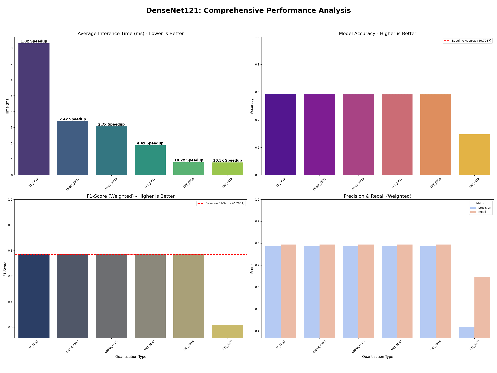
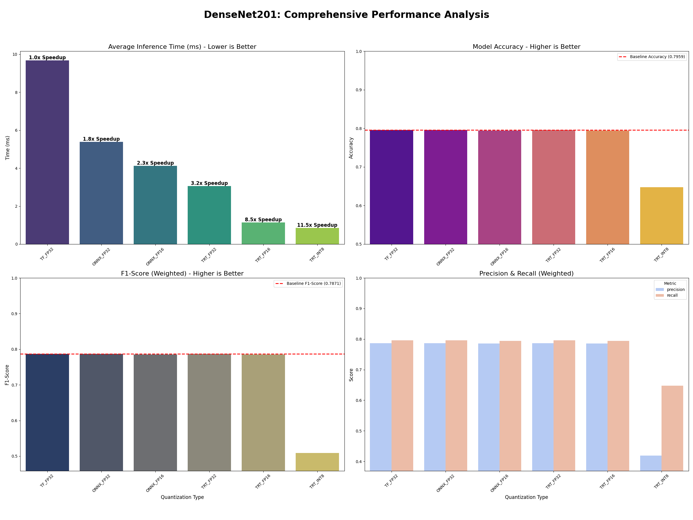

# Densenet-Quantization

This repository contains a comprehensive Python pipeline to convert TensorFlow Keras (`.h5`) models into highly optimized NVIDIA TensorRT engines. It supports conversion to **FP32**, **FP16**, and **INT8** precisions, with a strong focus on robust INT8 calibration to maintain model accuracy.

This project was developed to benchmark and accelerate model inference, demonstrating a **10x speedup** on modern GPUs with **zero accuracy loss** by converting models to TensorRT FP16.




## 📜 Table of Contents
- [🚀 Features](#features)
- [🛠️ Setup & Installation](#setup--installation)
  - [1. Prerequisites (Crucial!)](#1-prerequisites-crucial)
  - [2. Installation](#2-installation)
- [📁 Required Data Structure](#required-data-structure)
- [💡 How to Use the Converter (Core Logic)](#how-to-use-the-converter-core-logic)
- [📊 Evaluation & Benchmarking](#evaluation--benchmarking)
  - [Step 1: Create the Calibration Set](#step-1-create-the-calibration-set)
  - [Step 2: Run the Full Evaluation](#step-2-run-the-full-evaluation)
  - [Step 3: Visualize the Results](#step-3-visualize-the-results)
- [📈 Example Results](#example-results)
- [Libraries & Dependencies](#libraries--dependencies)


## 🚀 Features

* **Keras to ONNX:** Converts `.h5` weight files into ONNX `.onnx` models.
* **ONNX to TensorRT:** Converts `.onnx` models into optimized TensorRT `.trt` engines.
* **Full Precision Support:** Generates engines in FP32, FP16, and INT8.
* **Robust INT8 Calibration:** Includes a dynamic INT8 calibrator that uses a representative dataset to minimize accuracy loss.
* **Evaluation Pipeline:** A complete, separate evaluation framework (`evaluation/`) is provided to benchmark and validate the performance (accuracy, F1, speed) of all converted models against the original TensorFlow baseline.

---

## 🛠️ Setup & Installation

### 1. Prerequisites (Crucial!)

This project relies heavily on the NVIDIA GPU computing stack. You **must** have the following installed and configured correctly:

* **NVIDIA Driver:** A recent NVIDIA driver for your GPU.
* **CUDA Toolkit:** This project was tested with **CUDA 12.x**.
* **cuDNN:** The NVIDIA cuDNN library.
* **TensorRT:** The NVIDIA TensorRT library. The Python modules (`tensorrt`, `pycuda`) are listed in `requirements.txt`.

### 2. Installation

1.  **Clone the repository:**
    ```bash
    git clone https://github.com/Geridev/Densenet-Quantization.git
    cd Densenet-Quantization
    ```

2.  **Create a virtual environment (Recommended):**
    ```bash
    python -m venv venv
    source venv/bin/activate  # On Linux/macOS
    # .\venv\Scripts\activate   # On Windows
    ```

3.  **Install Python dependencies:**
    ```bash
    pip install -r requirements.txt
    ```

---

## 📁 Required Data Structure

Before running any scripts, you must organize your weights and data as follows:
```
data/
├── test/
│   ├── healthy/
│   ├── rubbish/
│   └── unhealthy/
├── calibration/
│   ├── healthy/
│   ├── rubbish/
│   └── unhealthy/
weights/
├── DenseNet121/
│   └── raw_weights.h5
└── DenseNet201/
    └── raw_weights.h5
```
---

## 💡 How to Use the Converter (Core Logic)

The main conversion logic is located in `src/model_converter/converter.py`. You can import and use this class in your own projects.

Here is a simple example of how to use the `ModelConverter` to convert a DenseNet121 model.

```python
# example_convert.py

from src.model_converter.converter import ModelConverter

# 1. Initialize the converter
converter = ModelConverter()

# --- Define model paths ---
model_name = 'DenseNet121'
base_path = 'models_generated/DenseNet121'
weights_path = 'weights/DenseNet121/raw_weights.h5'

onnx_fp32_path = f'{base_path}/{model_name}_fp32.onnx'
onnx_fp16_path = f'{base_path}/{model_name}_fp16.onnx'
trt_fp32_path = f'{base_path}/{model_name}_fp32.trt'
trt_fp16_path = f'{base_path}/{model_name}_fp16.trt'
trt_int8_path = f'{base_path}/{model_name}_int8.trt'

# --- 2. Convert TF -> ONNX ---

print("Converting TF to ONNX FP32...")
converter.tf_to_onnx(
    input_model=weights_path,
    output_path=onnx_fp32_path,
    precision='fp32',
    only_weigths_of_model=model_name
)

print("Converting TF to ONNX FP16...")
converter.tf_to_onnx(
    input_model=weights_path,
    output_path=onnx_fp16_path,
    precision='fp16',
    only_weigths_of_model=model_name
)

# --- 3. Convert ONNX -> TensorRT ---

# We use the FP32 ONNX model as the base for all TRT builds
base_onnx_model = onnx_fp32_path

print("Building TensorRT FP32 Engine...")
converter.onnx_to_trt(
    input_model=base_onnx_model,
    engine_file_path=trt_fp32_path,
    precision='fp32',
    opt_batch=32,
    max_batch=32
)

print("Building TensorRT FP16 Engine...")
converter.onnx_to_trt(
    input_model=base_onnx_model,
    engine_file_path=trt_fp16_path,
    precision='fp16',
    opt_batch=32,
    max_batch=32
)

print("Building TensorRT INT8 Engine...")
converter.onnx_to_trt(
    input_model=base_onnx_model,
    engine_file_path=trt_int8_path,
    precision='int8',
    calibration_images="data/calibration",  # Path to representative data
    calibration_cache="models_generated/DenseNet121/int8.cache",
    opt_batch=32,
    max_batch=32
)

# --- 4. Convert TF -> TensorRT ---

print("Converting TF to TRT FP32...")
converter.tf_to_trt(
    input_model=weights_path,
    engine_file_path=f'{base_path}/{model_name}_fp32.trt',
    only_weigths_of_model=model_name,
    precision='fp32',
    opt_batch=32,
    max_batch=32
)

print("Converting TF to TRT FP16...")
converter.tf_to_trt(
    input_model=weights_path,
    engine_file_path=f'{base_path}/{model_name}_fp16.trt',
    only_weigths_of_model=model_name,
    precision='fp16',
    opt_batch=32,
    max_batch=32
)

print("\nConverting TF to TRT INT8...")
# (Make sure data/calibration exists first!)
# (Run `python evaluation/prepare_calibration_set.py` first)
converter.tf_to_trt(
    input_model=weights_path,
    engine_file_path=f'{base_path}/{model_name}_int8.trt',
    only_weigths_of_model=model_name,
    precision='int8',
    calibration_images="data/calibration",
    calibration_cache=f"{base_path}/{model_name}_int8.cache",
    opt_batch=32,
    max_batch=32
)

print("All conversions complete.")
```

## 📊 Evaluation & Benchmarking

This repository also includes the full pipeline used to validate the converter and generate the performance plots.

This is a great example of how to use the converted models and compare their performance.

**Important:** All commands must be run from the **root directory** (`TensorRT-Model-Converter/`).

### Step 1: Create the Calibration Set

The INT8 calibrator needs a small, representative set of images. This script creates it by sampling 20% of your test data, maintaining the original class distribution.

```bash
python evaluation/prepare_calibration_set.py
```

This will create the (`data/calibration`) folder.


### Step 2: Run the Full Evaluation
This is the main script. It will automatically convert all models (FP32, FP16, INT8) and then run a full benchmark against the original TensorFlow model.

```bash
python evaluation/main_evaluation.py
```
#### This script will:

* **Generate** all **.onnx** and **.trt** models in models_generated/.

* **Run** inference on all 18k+ test images for each model.

* **Save** all results (`accuracy, f1, precision, recall, time`) to **evaluation_results.csv**.

### Step 3: Visualize the Results
This script reads the evaluation_results.csv and generates the final comparison plots.

```bash
python evaluation/stats.py
```
This will save `DenseNet121_Comparison_v2.png` and `DenseNet201_Comparison_v2.png` to your root directory.


## 📈 Example Results
The evaluation pipeline clearly shows the trade-offs of each quantization strategy.

* **Baseline (TF_FP32):** The original, slowest model.

* **ONNX:** Provides a 2-3x speedup with no accuracy loss.

* **TRT_FP32/FP16:** Provides a massive **~10x speedup** with **no accuracy loss**. This is the recommended strategy.

* **TRT_INT8:** Provides the fastest speed but suffers a significant accuracy drop, indicating that the DenseNet architecture has quantization-sensitive layers.

This demonstrates that for this model, TensorRT FP16 is the optimal solution, balancing maximum performance with perfect accuracy.


## Libraries & Dependencies
* TensorFlow

* NVIDIA TensorRT

* PyCUDA

* ONNX

* ONNXRuntime-GPU

* Scikit-learn

* Pandas

* Matplotlib & Seaborn